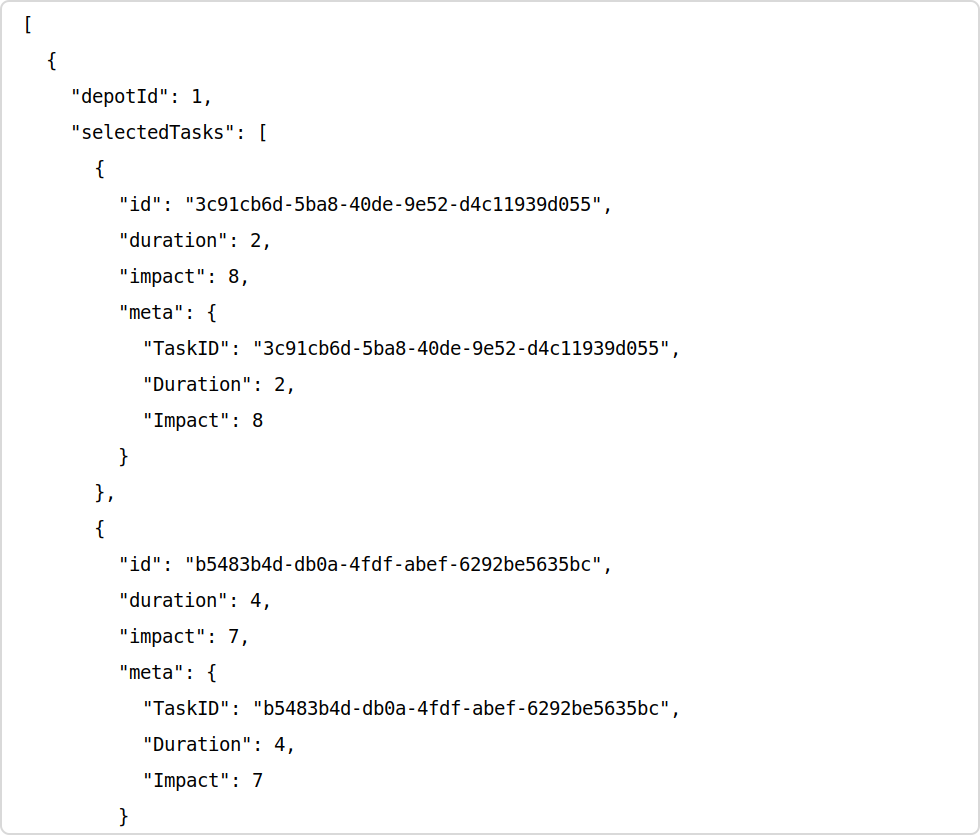
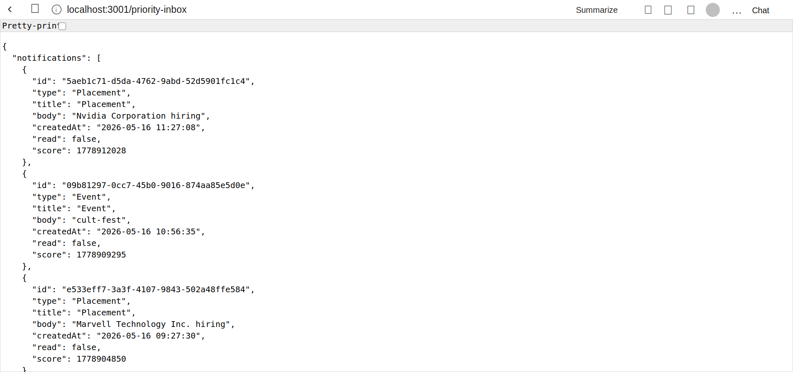

# Exam 1 Backend Services

This repository contains two local Express services:

- Vehicle Scheduling service on `http://localhost:3000`
- Notification System service on `http://localhost:3001`

## Run

Install dependencies from the repository root:

```bash
npm install
```

Start both services:

```bash
npm run dev
```

Or run them individually:

```bash
npm run dev:vehicle
npm run dev:notification
```

## Results

### Vehicle Scheduling

Health check:

```text
GET http://localhost:3000/
200 OK
{"status":"ok"}
```

Schedule endpoint:

```text
GET http://localhost:3000/schedule
200 OK
```

The endpoint returns depot schedules with selected tasks, total duration, and total impact.

Observed result from local endpoint:



```json
[
  {
    "depotId": 1,
    "selectedTasks": [
      {
        "id": "3c91cb6d-5ba8-40de-9e52-d4c11939d055",
        "duration": 2,
        "impact": 8,
        "meta": {
          "TaskID": "3c91cb6d-5ba8-40de-9e52-d4c11939d055",
          "Duration": 2,
          "Impact": 8
        }
      },
      {
        "id": "b5483b4d-db0a-4fdf-abef-6292be5635bc",
        "duration": 4,
        "impact": 7,
        "meta": {
          "TaskID": "b5483b4d-db0a-4fdf-abef-6292be5635bc",
          "Duration": 4,
          "Impact": 7
        }
      },
      {
        "id": "a9bbae16-284f-4939-b425-36947f5e4948",
        "duration": 2,
        "impact": 5,
        "meta": {
          "TaskID": "a9bbae16-284f-4939-b425-36947f5e4948",
          "Duration": 2,
          "Impact": 5
        }
      }
    ],
    "totalDuration": 60,
    "totalImpact": 132
  },
  {
    "depotId": 2,
    "selectedTasks": [
      {
        "id": "eef0e2dc-d76e-4717-8d44-bc0a4cacc964",
        "duration": 8,
        "impact": 4
      },
      {
        "id": "270a5b23-d53d-4a96-bd18-2697c3ce06bf",
        "duration": 1,
        "impact": 10
      }
    ],
    "totalDuration": 135,
    "totalImpact": 198
  }
]
```

### Notification System

Health check:

```text
GET http://localhost:3001/
200 OK
{"status":"notification system running"}
```

Priority inbox endpoint:

```text
GET http://localhost:3001/priority-inbox
200 OK
```

The endpoint returns the top unread notifications sorted by priority.

Observed result from local browser:



```json
{
  "notifications": [
    {
      "id": "5aeb1c71-d5da-4762-9abd-52d5901fc1c4",
      "type": "Placement",
      "title": "Placement",
      "body": "Nvidia Corporation hiring",
      "createdAt": "2026-05-16 11:27:08",
      "read": false,
      "score": 1778912028
    },
    {
      "id": "09b81297-0cc7-45b0-9016-874aa85e5d0e",
      "type": "Event",
      "title": "Event",
      "body": "cult-fest",
      "createdAt": "2026-05-16 10:56:35",
      "read": false,
      "score": 1778909295
    },
    {
      "id": "e533eff7-3a3f-4107-9843-502a48ffe584",
      "type": "Placement",
      "title": "Placement",
      "body": "Marvell Technology Inc. hiring",
      "createdAt": "2026-05-16 09:27:30",
      "read": false,
      "score": 1778904850
    },
    {
      "id": "94830735-d375-4293-af7e-a3d96fe3c046",
      "type": "Event",
      "title": "Event",
      "body": "induction",
      "createdAt": "2026-05-16 08:54:56",
      "read": false,
      "score": 1778901996
    }
  ]
}
```

## Verification

Build check:

```bash
npm run build
```

Expected result:

```text
vehicle_scheduling build: pass
notification_system build: pass
```
